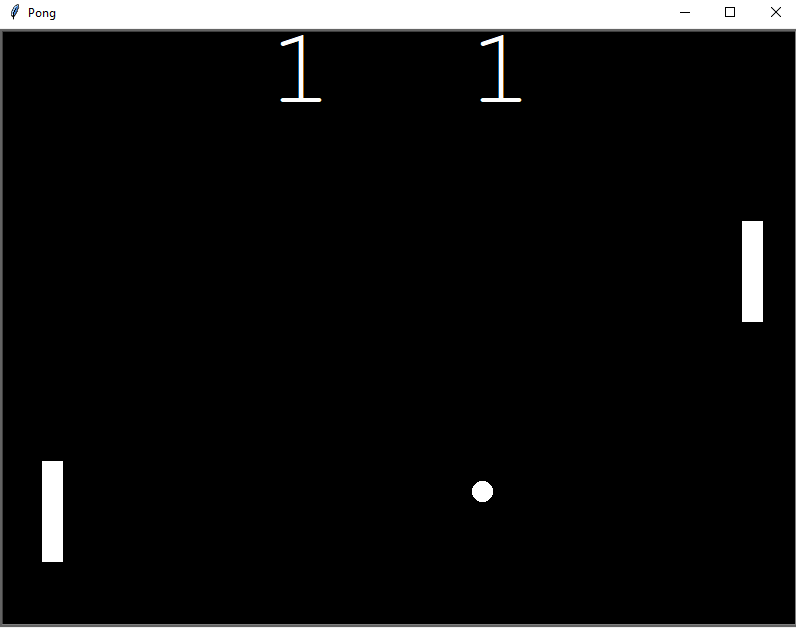

# Pong Game

The Pong Game is a classic arcade game where two paddles compete to hit a bouncing ball while avoiding misses. 

This Python-based Pong game allows you to control the paddles with your keyboard and test your reflexes and gaming skills.


## Introduction

The Pong Game brings back the nostalgia of playing a classic arcade game on your computer. 

In this game, two paddles compete to hit a bouncing ball.

The challenge is to avoid missing the ball while controlling the paddles using the keyboard.

A miss by a paddle results in a point for the opponent.

## Features

- Classic Pong gameplay with a modern Python twist.
- Responsive controls using the keyboard.
- Dynamic ball movement and paddle interactions.
- Two-player gameplay for friendly competition.
- Test your reflexes and gaming skills in a fun and engaging way.

## How to Play

Clone the repository to your local machine:

   ```sh
   git clone https://github.com/aFro95/Build-pong-arcade-game.git
   ```

## Usage

1. **Run the Script**: Execute the script using Python:
    ```bash
    python main.py
    ```

2. **Game Controls**:
   - Right Paddle: Up Arrow (Move Up), Down Arrow (Move Down)
   - Left Paddle: W (Move Up), S (Move Down)

3. **Gameplay**:
   - The objective is to prevent the ball from passing your paddle while trying to make it pass your opponent's paddle.
   - Each time the ball passes your opponent's paddle, you score a point.
   - The game continues until you exit the window.
  
## Customization

- **Screen Size**: You can adjust the width and height of the game screen by modifying the `screen.setup(width=800, height=600)` line in the script.
- **Paddle Speed**: You can adjust the speed of the paddles by modifying the `Paddle` class in the `paddle.py` module.
- **Ball Speed**: You can adjust the speed of the ball by modifying the `Ball` class in the `ball.py` module.
